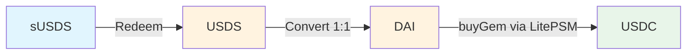
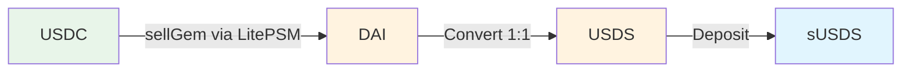
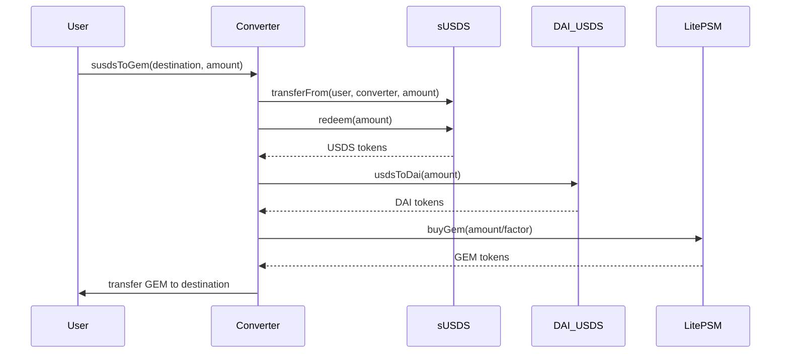
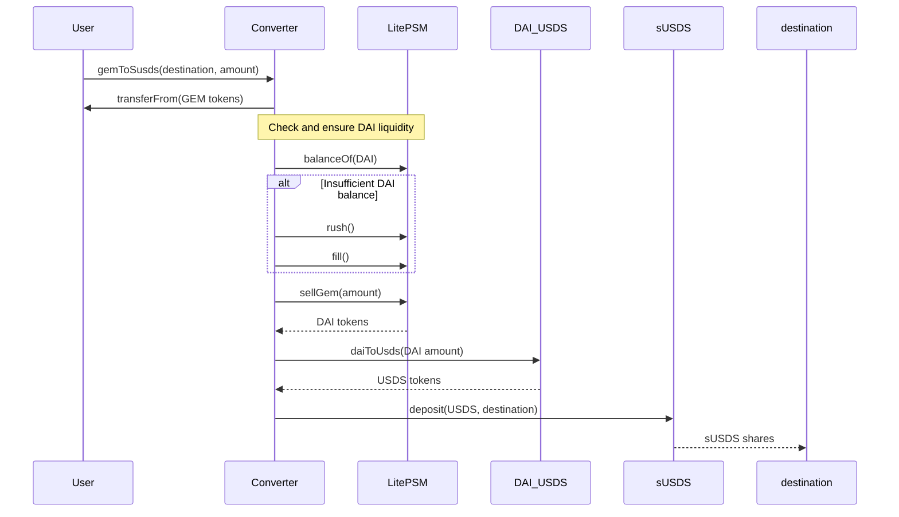
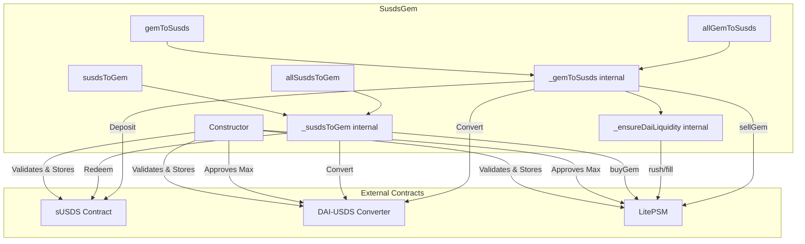
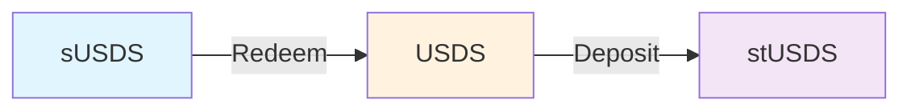
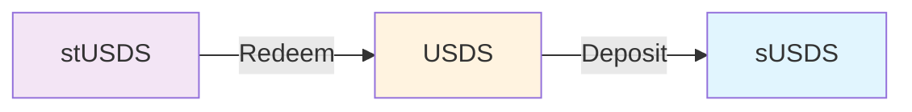
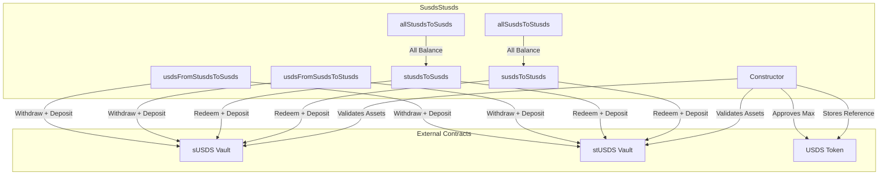

# Sky Utils

⚠️ **IMPORTANT SECURITY NOTICE** ⚠️

> **This code has NOT been audited. Use at your own risk.**
>
> This repository contains experimental smart contracts that have not undergone formal security auditing. Do not use in production without proper review and auditing.

## Overview

Sky Utils provides smart contracts for interacting with the Sky Protocol, enabling seamless token conversions within the Sky ecosystem.

### Available Contracts

| Contract | Description | Gas Usage |
|----------|-------------|-----------|
| **SusdsGem** | Convert sUSDS ↔ USDC through Sky Protocol's LitePSM | ~400k gas |
| **SusdsStusds** | Convert sUSDS ↔ stUSDS through direct vault operations | ~250k gas |

## SusdsGem

This contract enables seamless bidirectional conversion between sUSDS (Savings USDS) tokens and USDC through the Sky Protocol's conversion mechanisms.

**Features:** 🔄 Bidirectional conversion • 🛡️ Slippage protection • ⚡ Gas-efficient • 🔒 Non-custodial

**Gas Usage:** ~400k gas per conversion

### Interface

```solidity
interface ISusdsGem {
    // Convert specific amount with no slippage tolerance
    function susdsToGem(address destination, uint256 sUsdsWad) external;

    // Convert with custom slippage tolerance (in basis points)
    function susdsToGem(address destination, uint256 sUsdsWad, uint256 maxSlippageBps) external;

    // Convert entire sUSDS balance
    function allSusdsToGem(address destination) external;

    // Convert all with slippage tolerance
    function allSusdsToGem(address destination, uint256 maxSlippageBps) external;

    // Reverse conversions: USDC to sUSDS

    // Convert specific amount with no slippage tolerance
    function gemToSusds(address destination, uint256 gemAmt) external;

    // Convert with custom slippage tolerance (in basis points)
    function gemToSusds(address destination, uint256 gemAmt, uint256 maxSlippageBps) external;

    // Convert entire USDC balance
    function allGemToSusds(address destination) external;

    // Convert all with slippage tolerance
    function allGemToSusds(address destination, uint256 maxSlippageBps) external;
}
```

<details>
<summary><b>📖 Detailed Documentation</b></summary>

### Features

- 🔄 Bidirectional conversion between sUSDS and USDC
- 💰 No intermediate token handling required
- 🛡️ Built-in slippage protection
- ⚡ Gas-efficient batch operations
- 🔒 Non-custodial (no token storage)

### How It Works

#### sUSDS to USDC

The converter performs a three-step atomic conversion:


```mermaid
graph LR
    A[sUSDS] -->|Redeem| B[USDS]
    B -->|Convert 1:1| C[DAI]
    C -->|buyGem via LitePSM| D[USDC]

    style A fill:#e1f5fe
    style B fill:#fff3e0
    style C fill:#fff3e0
    style D fill:#e8f5e9
```

#### USDC to sUSDS

The reverse conversion flow:


```mermaid
graph LR
    A[USDC] -->|sellGem via LitePSM| B[DAI]
    B -->|Convert 1:1| C[USDS]
    C -->|Deposit| D[sUSDS]

    style A fill:#e8f5e9
    style B fill:#fff3e0
    style C fill:#fff3e0
    style D fill:#e1f5fe
```

*Note: The converter automatically manages LitePSM's DAI buffer by checking liquidity and calling `fill()` if needed before the swap.*

##### DAI Buffer Management

The LitePSM maintains a pre-minted DAI buffer for efficient swaps. When converting USDC to sUSDS, if the PSM's DAI balance is insufficient, the converter automatically:

1. Checks available minting capacity via `rush()`
2. Calls `fill()` to mint additional DAI if needed
3. Proceeds with the swap

This ensures conversions succeed even when the PSM's buffer is temporarily depleted.

#### Detailed Flow

##### sUSDS to GEM Conversion


```mermaid
sequenceDiagram
    participant User
    participant Converter
    participant sUSDS
    participant DAI_USDS
    participant LitePSM

    User->>Converter: susdsToGem(destination, amount)
    Converter->>sUSDS: transferFrom(user, converter, amount)
    Converter->>sUSDS: redeem(amount)
    sUSDS-->>Converter: USDS tokens
    Converter->>DAI_USDS: usdsToDai(amount)
    DAI_USDS-->>Converter: DAI tokens
    Converter->>LitePSM: buyGem(amount/factor)
    LitePSM-->>Converter: GEM tokens
    Converter->>User: transfer GEM to destination
```

##### GEM to sUSDS Conversion


```mermaid
sequenceDiagram
    participant User
    participant Converter
    participant LitePSM
    participant DAI_USDS
    participant sUSDS

    User->>Converter: gemToSusds(destination, amount)
    Converter->>User: transferFrom(GEM tokens)
    
    Note over Converter,LitePSM: Check and ensure DAI liquidity
    Converter->>LitePSM: balanceOf(DAI)
    alt Insufficient DAI balance
        Converter->>LitePSM: rush()
        Converter->>LitePSM: fill()
    end
    
    Converter->>LitePSM: sellGem(amount)
    LitePSM-->>Converter: DAI tokens
    Converter->>DAI_USDS: daiToUsds(DAI amount)
    DAI_USDS-->>Converter: USDS tokens
    Converter->>sUSDS: deposit(USDS, destination)
    sUSDS-->>destination: sUSDS shares
```

### Usage

#### Example Integration

```solidity
// Approve the converter
IERC20(sUSDS).approve(converterAddress, amount);

// Convert 100 sUSDS to USDC with 0.5% slippage tolerance
converter.susdsToGem(myAddress, 100e18, 50);

// Convert all sUSDS balance to USDC
converter.allSusdsToGem(myAddress);

// Reverse: Convert 100 USDC to sUSDS
IERC20(USDC).approve(converterAddress, 100e6);
converter.gemToSusds(myAddress, 100e6);

// Convert all USDC balance to sUSDS
converter.allGemToSusds(myAddress);
```

### Contract Architecture


```mermaid
graph TB
    subgraph "External Contracts"
        A[sUSDS Contract]
        B[DAI-USDS Converter]
        C[LitePSM]
    end

    subgraph "SusdsGem"
        D[Constructor]
        E[susdsToGem]
        F[allSusdsToGem]
        G[gemToSusds]
        H[allGemToSusds]
        I[_susdsToGem internal]
        J[_gemToSusds internal]
        K[_ensureDaiLiquidity internal]
    end

    D -->|Validates & Stores| A
    D -->|Validates & Stores| B
    D -->|Validates & Stores| C
    D -->|Approves Max| B
    D -->|Approves Max| C

    E --> I
    F --> I
    G --> J
    H --> J
    I -->|Redeem| A
    I -->|Convert| B
    I -->|buyGem| C
    J --> K
    K -->|rush/fill| C
    J -->|sellGem| C
    J -->|Convert| B
    J -->|Deposit| A
```

### Deployment Addresses

#### Ethereum Mainnet

| Contract | Address |
| -------- | ------- |
| SusdsGem | TODO    |

### Security Considerations

#### ⚠️ Unaudited Code Warning

This codebase has **NOT** been audited by professional security firms. Users should:

1. **Conduct their own review** before using in production
2. **Test thoroughly** on testnets first
3. **Consider getting a professional audit** for production use
4. **Use at your own risk** - the authors assume no liability

#### Built-in Protections

- ✅ Slippage protection with customizable tolerance
- ✅ Zero-amount transaction prevention
- ✅ Invalid address checks
- ✅ Atomic operations (all-or-nothing execution)
- ✅ No admin functions or upgradability risks
- ✅ Immutable contract addresses

#### Known Limitations

- Conversions may fail during extreme market conditions
- Gas costs vary based on network congestion
- Dependent on external protocol availability
- USDC to sUSDS conversions require sufficient LitePSM buffer capacity or available minting capacity (rush)

### Testing

Run the test suite for all contracts:

```bash
# Run all tests
forge test

# Run specific contract tests
forge test --match-contract SusdsGemTest
forge test --match-contract SusdsStusdsTest

# Run with verbosity
forge test -vv

# Run with gas reporting
forge test --gas-report

# Fork testing with mainnet
export ETH_RPC_URL="your_rpc_url"
forge test --fork-url $ETH_RPC_URL
```

### Gas Optimization

The contract is optimized for gas efficiency:

- Single SSTORE for approvals in constructor
- Minimal external calls
- Efficient decimal conversion using pre-calculated factors
- Batch operations to reduce per-transaction overhead

Typical gas usage: ~400,000 gas per conversion

</details>

## SusdsStusds

This contract enables seamless bidirectional conversion between sUSDS (Savings USDS) and stUSDS (Staked USDS) tokens through atomic vault operations.

**Features:** 🔄 Vault-to-vault conversion • ⚡ Atomic operations • 🔒 Non-custodial • 📊 Share & asset-based

**Gas Usage:** ~250k gas per conversion

### Interface

```solidity
interface ISusdsStusds {
    // Share-based conversions (redeem/deposit shares)
    function susdsToStusds(address dst, uint256 wad) external returns (uint256 usdsAmount);
    function stusdsToSusds(address dst, uint256 wad) external returns (uint256 usdsAmount);
    
    // Convert entire balance
    function allSusdsToStusds(address dst) external returns (uint256 usdsAmount);
    function allStusdsToSusds(address dst) external returns (uint256 usdsAmount);
    
    // Asset-based conversions (withdraw/deposit specific USDS amounts)
    function usdsFromSusdsToStusds(address dst, uint256 wad) 
        external returns (uint256 stusdsSharesOut, uint256 susdsSharesIn);
    function usdsFromStusdsToSusds(address dst, uint256 wad) 
        external returns (uint256 susdsSharesOut, uint256 stusdsSharesIn);
}
```

<details>
<summary><b>📖 Detailed Documentation</b></summary>

### Features

- 🔄 Bidirectional conversion between sUSDS and stUSDS
- 💰 Direct vault-to-vault conversion without intermediate tokens
- ⚡ Gas-efficient atomic operations
- 🔒 Non-custodial (no token storage)
- 📊 Support for both share-based and asset-based conversions

### How It Works

Both sUSDS and stUSDS are ERC4626 vaults backed by the same underlying USDS asset, enabling seamless conversions.

#### sUSDS to stUSDS


```mermaid
graph LR
    A[sUSDS] -->|Redeem| B[USDS]
    B -->|Deposit| C[stUSDS]

    style A fill:#e1f5fe
    style B fill:#fff3e0
    style C fill:#f3e5f5
```

#### stUSDS to sUSDS


```mermaid
graph LR
    A[stUSDS] -->|Redeem| B[USDS]
    B -->|Deposit| C[sUSDS]

    style A fill:#f3e5f5
    style B fill:#fff3e0
    style C fill:#e1f5fe
```

### Usage

#### Example Integration

```solidity
// Approve the converter
IERC20(sUSDS).approve(converterAddress, amount);

// Convert 100 sUSDS shares to stUSDS
uint256 usdsSwapped = converter.susdsToStusds(myAddress, 100e18);

// Convert all sUSDS balance to stUSDS
converter.allSusdsToStusds(myAddress);

// Asset-based conversion: withdraw exactly 100 USDS from sUSDS and deposit into stUSDS
(uint256 stusdsOut, uint256 susdsIn) = converter.usdsFromSusdsToStusds(myAddress, 100e18);

// Reverse conversions
IERC20(stUSDS).approve(converterAddress, amount);
converter.stusdsToSusds(myAddress, 100e18);
```

### Contract Architecture


```mermaid
graph TB
    subgraph "External Contracts"
        A[sUSDS Vault]
        B[stUSDS Vault]
        C[USDS Token]
    end

    subgraph "SusdsStusds"
        D[Constructor]
        E[susdsToStusds]
        F[stusdsToSusds]
        G[allSusdsToStusds]
        H[allStusdsToSusds]
        I[usdsFromSusdsToStusds]
        J[usdsFromStusdsToSusds]
    end

    D -->|Validates Assets| A
    D -->|Validates Assets| B
    D -->|Stores Reference| C
    D -->|Approves Max| C

    E -->|Redeem + Deposit| A
    E -->|Redeem + Deposit| B
    F -->|Redeem + Deposit| B
    F -->|Redeem + Deposit| A
    G -->|All Balance| E
    H -->|All Balance| F
    I -->|Withdraw + Deposit| A
    I -->|Withdraw + Deposit| B
    J -->|Withdraw + Deposit| B
    J -->|Withdraw + Deposit| A
```

### Deployment Addresses

#### Ethereum Mainnet

| Contract | Address |
| -------- | ------- |
| SusdsStusds | TODO |

### Gas Optimization

The SusdsStusds contract is optimized for gas efficiency:

- Single approval setup in constructor
- Direct vault-to-vault operations (no intermediate tokens)
- Minimal external calls per conversion
- Atomic operations to reduce transaction overhead

Typical gas usage: ~250,000 gas per conversion

</details>

## Installation

### Prerequisites

- [Foundry](https://book.getfoundry.sh/getting-started/installation)
- Git

### Setup

```bash
# Clone the repository
git clone https://github.com/yourusername/sky-utils.git
cd sky-utils

# Install dependencies
forge install

# Run tests
forge test
```

## Contributing

Contributions are welcome! Please:

1. Fork the repository
2. Create a feature branch
3. Add tests for new functionality
4. Ensure all tests pass
5. Submit a pull request

## License

This project is licensed under the **GNU Affero General Public License v3.0 (AGPLv3)**.

See [LICENSE](LICENSE) file for details.

## Disclaimer

THIS SOFTWARE IS PROVIDED "AS IS", WITHOUT WARRANTY OF ANY KIND, EXPRESS OR IMPLIED. IN NO EVENT SHALL THE AUTHORS OR COPYRIGHT HOLDERS BE LIABLE FOR ANY CLAIM, DAMAGES OR OTHER LIABILITY ARISING FROM THE USE OF THIS SOFTWARE.

**USE AT YOUR OWN RISK. THIS CODE HAS NOT BEEN AUDITED.**

## Support

For questions and support, please open an issue on GitHub.

---

Built with ❤️ using Foundry
