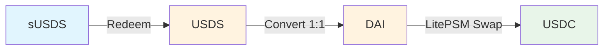

# Sky Utils

⚠️ **IMPORTANT SECURITY NOTICE** ⚠️

> **This code has NOT been audited. Use at your own risk.**
>
> This repository contains experimental smart contracts that have not undergone formal security auditing. Do not use in production without proper review and auditing.

## Overview

Sky Utils provides smart contracts for interacting with the Sky Protocol.

## SusdsGem

This contract enables seamless bidirectional conversion between sUSDS (Savings USDS) tokens and USDC through the Sky Plotocol's conversion mechanisms.

### Features

- 🔄 Bidirectional conversion between sUSDS and USDC
- 💰 No intermediate token handling required
- 🛡️ Built-in slippage protection
- ⚡ Gas-efficient batch operations
- 🔒 Non-custodial (no token storage)

### How It Works

#### sUSDS to USDC

The converter performs a three-step atomic conversion:



#### USDC to sUSDS

The reverse conversion flow:


##### DAI Buffer Management

The LitePSM maintains a pre-minted DAI buffer for efficient swaps. When converting USDC to sUSDS, if the PSM's DAI balance is insufficient, the converter automatically:

1. Checks available minting capacity via `rush()`
2. Calls `fill()` to mint additional DAI if needed
3. Proceeds with the swap

This ensures conversions succeed even when the PSM's buffer is temporarily depleted.

#### Detailed Flow


### Usage

#### Smart Contract Interface

```solidity
interface ISusdsGem {
    // Convert specific amount with no slippage tolerance
    function susdsToGem(address destination, uint256 sUsdsWad) external;

    // Convert with custom slippage tolerance (in basis points)
    function susdsToGem(address destination, uint256 sUsdsWad, uint256 maxSlippageBps) external;

    // Convert entire sUSDS balance
    function allSusdsToGem(address destination) external;

    // Convert all with slippage tolerance
    function allSusdsToGem(address destination, uint256 maxSlippageBps) external;

    // Reverse conversions: USDC to sUSDS

    // Convert specific amount with no slippage tolerance
    function gemToSusds(address destination, uint256 gemAmt) external;

    // Convert with custom slippage tolerance (in basis points)
    function gemToSusds(address destination, uint256 gemAmt, uint256 maxSlippageBps) external;

    // Convert entire USDC balance
    function allGemToSusds(address destination) external;

    // Convert all with slippage tolerance
    function allGemToSusds(address destination, uint256 maxSlippageBps) external;
}
```

#### Example Integration

```solidity
// Approve the converter
IERC20(sUSDS).approve(converterAddress, amount);

// Convert 100 sUSDS to USDC with 0.5% slippage tolerance
converter.susdsToGem(myAddress, 100e18, 50);

// Convert all sUSDS balance to USDC
converter.allSusdsToGem(myAddress);

// Reverse: Convert 100 USDC to sUSDS
IERC20(USDC).approve(converterAddress, 100e6);
converter.gemToSusds(myAddress, 100e6);

// Convert all USDC balance to sUSDS
converter.allGemToSusds(myAddress);
```

### Contract Architecture


### Deployment Addresses

#### Ethereum Mainnet

| Contract | Address |
| -------- | ------- |
| SusdsGem | TODO    |

### Security Considerations

#### ⚠️ Unaudited Code Warning

This codebase has **NOT** been audited by professional security firms. Users should:

1. **Conduct their own review** before using in production
2. **Test thoroughly** on testnets first
3. **Consider getting a professional audit** for production use
4. **Use at your own risk** - the authors assume no liability

#### Built-in Protections

- ✅ Slippage protection with customizable tolerance
- ✅ Zero-amount transaction prevention
- ✅ Invalid address checks
- ✅ Atomic operations (all-or-nothing execution)
- ✅ No admin functions or upgradability risks
- ✅ Immutable contract addresses

#### Known Limitations

- Conversions may fail during extreme market conditions
- Gas costs vary based on network congestion
- Dependent on external protocol availability
- USDC to sUSDS conversions require sufficient LitePSM buffer capacity or available minting capacity (rush)

### Testing

Run the test suite for SusdsGem:

```bash
# Run all tests
forge test

# Run with verbosity
forge test -vv

# Run with gas reporting
forge test --gas-report

# Fork testing with mainnet
export ETH_RPC_URL="your_rpc_url"
forge test --fork-url $ETH_RPC_URL
```

### Gas Optimization

The contract is optimized for gas efficiency:

- Single SSTORE for approvals in constructor
- Minimal external calls
- Efficient decimal conversion using pre-calculated factors
- Batch operations to reduce per-transaction overhead

Typical gas usage: ~400,000 gas per conversion

## Installation

### Prerequisites

- [Foundry](https://book.getfoundry.sh/getting-started/installation)
- Git

### Setup

```bash
# Clone the repository
git clone https://github.com/yourusername/sky-utils.git
cd sky-utils

# Install dependencies
forge install

# Run tests
forge test
```

## Contributing

Contributions are welcome! Please:

1. Fork the repository
2. Create a feature branch
3. Add tests for new functionality
4. Ensure all tests pass
5. Submit a pull request

## License

This project is licensed under the **GNU Affero General Public License v3.0 (AGPLv3)**.

See [LICENSE](LICENSE) file for details.

## Disclaimer

THIS SOFTWARE IS PROVIDED "AS IS", WITHOUT WARRANTY OF ANY KIND, EXPRESS OR IMPLIED. IN NO EVENT SHALL THE AUTHORS OR COPYRIGHT HOLDERS BE LIABLE FOR ANY CLAIM, DAMAGES OR OTHER LIABILITY ARISING FROM THE USE OF THIS SOFTWARE.

**USE AT YOUR OWN RISK. THIS CODE HAS NOT BEEN AUDITED.**

## Support

For questions and support, please open an issue on GitHub.

---

Built with ❤️ using Foundry
